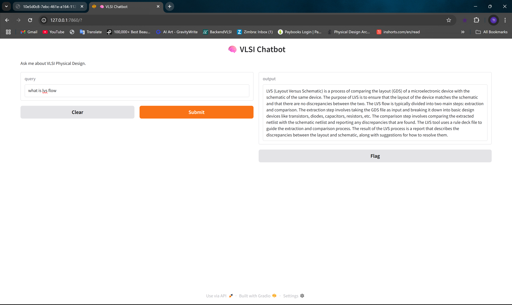

# 🧠 VLSI RAG Chatbot — Offline GPT Assistant for Chip Design Docs

This project is a **local Retrieval-Augmented Generation (RAG) chatbot** for VLSI Physical Design engineers. It uses **open-source LLMs** and **your own documents** (PDFs, PPTs, DOCXs) to answer questions without needing the internet or OpenAI APIs.

> _“Ask questions about timing closure, floorplanning, or CTS — directly from your own chip design docs.”_

---

## 📚 Documentation Index

- [🧠 RAG Architecture & Flow](ARCHITECTURE.md)
- [ RAG Retrieval-Augmented Generation](Retrieval_Augmented_Generation.md)
- [📄 Document Ingestion & Embedding](INGESTION.md)
- [⚙️ Local Setup Guide](SETUP_GUIDE.md)
- [🗂 Folder Structure Explained](FOLDER_STRUCTURE.md)
- [🚧 Limitations & Future Plans](FUTURE_PLANS.md)

---

## ✨ Features

- Fully local — no OpenAI key needed
- Works on `.pdf`, `.docx`, `.pptx`, `.txt`
- Uses **Mistral-7B GGUF** model (via llama.cpp)
- Embeds your documents with `sentence-transformers`
- Uses **ChromaDB** for vector search
- Built and run completely inside **VS Code**

---

## 💡 Use Case

This tool is ideal for:

- VLSI engineers who want AI help without leaking data
- Interview preparation based on company-specific design flows
- Quickly querying internal documentation or training slides

---

## 🧪 Example Questions

- _“What is the use of decap cells in floorplan?”_
- _“Why do we use tie-high/tie-low cells?”_
- _“Explain IR drop during placement stage.”_

---

## 👏 Built With

- `llama-cpp-python`
- `sentence-transformers`
- `chromadb`
- `PyMuPDF`, `python-docx`, `python-pptx`
- `Gradio` (for the chat UI)

---

> _This project is part of my learning journey in prompt engineering and VLSI automation._  
> _Built with ❤️, zero cost, and full curiosity._

---
## 🖼️ Demo Screenshot

## 🔗 License

This project is released under the MIT License.
